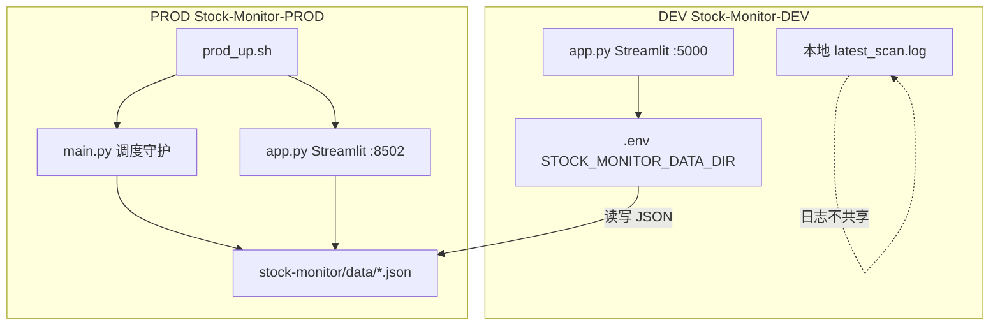
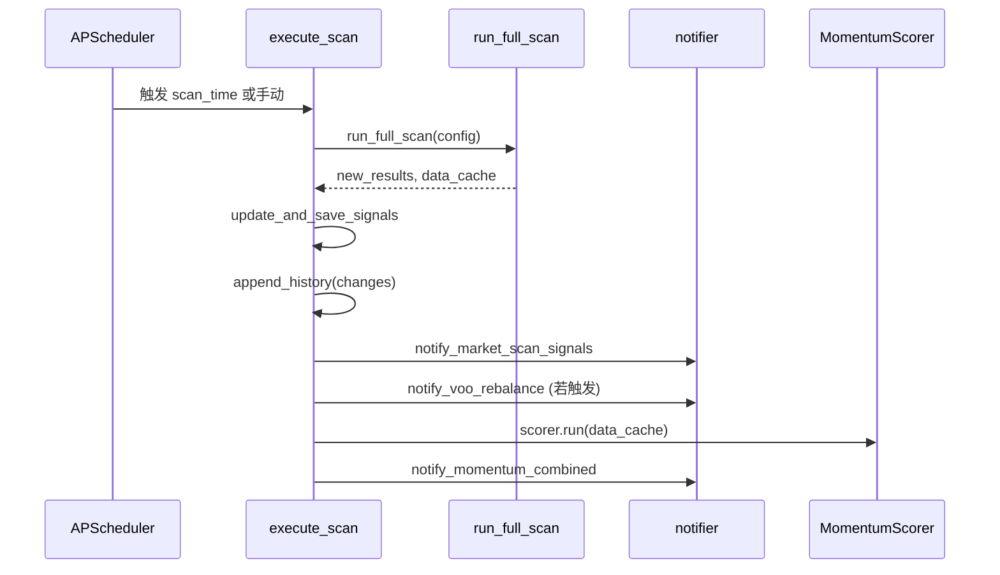

# Stock Monitor 项目文档

> 版本基准：`master` @ `183e2d9`（2026-06）
> 仓库：Stock-Monitor-DEV（开发）/ Stock-Monitor-PROD（生产）

---

## 目录

1. [项目概述](#1-项目概述)
2. [DEV 与 PROD 环境关系](#2-dev-与-prod-环境关系)
3. [目录与关键文件](#3-目录与关键文件)
4. [配置与环境变量](#4-配置与环境变量)
5. [定时扫描流程](#5-定时扫描流程)
6. [策略逻辑与计算公式](#6-策略逻辑与计算公式)
7. [动量状态与数据文件](#7-动量状态与数据文件)
8. [Streamlit 看板结构](#8-streamlit-看板结构)
9. [Bark 推送](#9-bark-推送)
10. [已实现功能清单](#10-已实现功能清单)
11. [未实现 / 已知限制 / 待办](#11-未实现--已知限制--待办)
12. [运维手册](#12-运维手册)
13. [附录：公式速查表](#13-附录公式速查表)

---

## 1. 项目概述

### 1.1 系统目标

Stock Monitor 是一套多策略股票监控与交易系统，主要能力包括：

- **多策略信号扫描**：美股大盘、疯牛、再平衡提醒、动量个股等
- **动量自动交易**：信号收盘判定，次日开盘自动买卖（T+1）
- **Bark 推送**：定时/手动扫描结果推送到手机
- **Streamlit 看板**：实时信号、持仓、动量排名、执行日志、手动调仓

### 1.2 技术栈

| 组件 | 技术 |
|------|------|
| 语言 | Python 3 |
| 看板 | Streamlit |
| 定时任务 | APScheduler (`BackgroundScheduler`) |
| 数据处理 | pandas |
| 行情数据 | yfinance 等（`strategy.fetch_with_retry`） |
| 推送 | [Bark](https://github.com/Finb/Bark) API |
| 配置 | `config.json` + `.env` 环境变量覆盖 |

### 1.3 双仓库工作流

| 仓库 | 路径示例 | 角色 |
|------|----------|------|
| **DEV** | `Stock-Monitor-DEV` | 开发、改代码、本地看板（:5000） |
| **PROD** | `Stock-Monitor-PROD` | 生产定时扫描 + 看板（:8502） |

**代码流**：DEV 修改 → `git push` → PROD `git pull` → **重启进程**（`prod_up.sh`）

**数据流**：运行时 JSON **只维护 PROD** 一份；DEV 通过环境变量指向同目录（见第 2 章）

---

## 2. DEV 与 PROD 环境关系

### 2.1 架构图



### 2.2 数据目录解析

`state_manager.py` 中 `DATA_DIR` 的解析逻辑：

```python
# 默认：当前仓库 stock-monitor/data/
# 覆盖：环境变量 STOCK_MONITOR_DATA_DIR 指向绝对路径
DATA_DIR = _resolve_data_dir()
```

**DEV 典型配置**（`.env.example`）：

```bash
STOCK_MONITOR_DATA_DIR=/absolute/path/to/Stock-Monitor-PROD/stock-monitor/data
ENV_TYPE=DEVELOPMENT
BARK_KEY=...
```

### 2.3 关键设计决策

| 决策 | 说明 |
|------|------|
| **数据只维护一份** | `stock-monitor/data/*.json` 不进 Git（`.gitignore`），PROD 为唯一真相源 |
| **日志分离** | `latest_scan.log` **始终**写在各环境本地 `stock-monitor/data/`，不随 `STOCK_MONITOR_DATA_DIR` 迁移 |
| **进程分离** | PROD：`main.py`（调度）+ `app.py`（看板）两个独立进程；DEV 看板**不**内嵌 scheduler |
| **手动扫描保护** | DEV 手动扫描在 `scan_time` 各时段 **±2 分钟**内被拦截，避免与 PROD 定时扫描写同一 data 冲突 |

### 2.4 进程与端口

| 环境 | 进程 | 端口 | 启动方式 |
|------|------|------|----------|
| DEV | Streamlit `app.py` | **5000** | `streamlit run stock-monitor/app.py` |
| PROD | `main.py` + Streamlit `app.py` | **8502** | `sh prod_up.sh` |

DEV `app.py` 中 `start_scheduler()` 已注释——调度由 PROD 独立 `main.py` 负责。

### 2.5 运维陷阱（必读）

1. **`git reset --hard`**：在 `data/` 已 untrack 后**不会**删除 JSON 文件
2. **`git clean -fd`**：**会删除**未跟踪的 `data/` 目录——**禁止在 PROD 上执行**
3. **代码更新后必须重启**：`git pull` 后须 `prod_up.sh` 重启看板 + 调度器；否则内存中仍是旧模块，会出现：
   - Bark 缺少「RS120最高」行
   - `cannot import name 'format_rs_pct' from 'momentum_scorer'`
4. **半更新状态**：若只更新了 `notifier.py`/`app.py` 而 `momentum_scorer.py` 未同步，import 会失败

### 2.6 PROD 启动脚本 `prod_up.sh`

路径：`Stock-Monitor-PROD/prod_up.sh`（不进 DEV Git，`*.sh` 被 ignore）

执行顺序：

1. 释放 8502 端口，杀掉旧 `main.py` / `app.py`
2. `nohup python3 stock-monitor/main.py` → `data/prod_scheduler.log`
3. `nohup streamlit run stock-monitor/app.py --server.port 8502` → `data/prod_web.log`
4. `tail -f stock-monitor/data/latest_scan.log`

**两套日志目录**：

| 路径 | 内容 |
|------|------|
| `Stock-Monitor-PROD/data/` | `prod_scheduler.log`、`prod_web.log` |
| `Stock-Monitor-PROD/stock-monitor/data/` | 运行时 JSON + `latest_scan.log` |

---

## 3. 目录与关键文件

```
Stock-Monitor-{DEV|PROD}/
├── .env                    # 密钥与 STOCK_MONITOR_DATA_DIR（gitignore）
├── .env.example            # 环境变量模板
├── docs/
│   └── PROJECT.md          # 本文档
├── stock-monitor/
│   ├── app.py              # Streamlit 看板
│   ├── main.py             # 独立调度守护进程
│   ├── scheduler.py        # execute_scan、Cron 注册、手动扫描拦截
│   ├── strategy.py         # 大盘/疯牛/再平衡/legacy 个股扫描
│   ├── momentum_scorer.py  # 个股动量系统 V3.0
│   ├── state_manager.py    # 配置、DATA_DIR、JSON 读写
│   ├── notifier.py         # Bark 推送
│   ├── position_manager.py # 手动调仓
│   ├── position_state.py   # 大盘/疯牛持仓状态
│   ├── scorer.py           # 遗留评分模块（未接入）
│   ├── debug_tool.py       # 调试/回溯工具
│   └── data/               # 运行时数据（gitignore）
└── .streamlit/config.toml  # DEV 端口 5000
```

| 文件 | 职责 |
|------|------|
| `app.py` | 看板 UI、手动扫描、动量展示、调仓对话框 |
| `main.py` | 启动 APScheduler，保持主线程不退出 |
| `scheduler.py` | `execute_scan()` 全量扫描流水线 |
| `strategy.py` | `run_full_scan()`、各策略信号函数、数据缓存 |
| `momentum_scorer.py` | 动量扫描、持仓审计、T+1 执行引擎 |
| `state_manager.py` | `load_config`、`load_signals`、`get_data_path` |
| `notifier.py` | 市场信号、再平衡、动量合并 Bark |

---

## 4. 配置与环境变量

### 4.1 config.json 字段

路径：`{DATA_DIR}/config.json`（默认 `stock-monitor/data/config.json`）

| 字段 | 类型 | 默认值 | 说明 |
|------|------|--------|------|
| `bark_key` | string | `""` | Bark API Key（可被 `BARK_KEY` 环境变量覆盖） |
| `tickers` | string[] | `["NVDA","AAPL","MSFT","159915.SZ:EMA100"]` | 动量 V3.0 交易/候选标的列表；默认 EMA50，旧写法仍支持 `ticker:EMA窗口` 单票覆盖 |
| `ytd_tickers` | string[] | `["AAPL","MSFT","GOOGL","AMZN","NVDA","META","TSLA","AVGO","QQQ","VOO","TQQQ","SPCX","^KS11","VUAA.L","SOXL"]` | 页面顶部 `YTD 涨幅` 胶囊标的列表；DEV/PROD 均从运行时 `{DATA_DIR}/config.json` 读取 |
| `ytd_display_names` | object | `{ "^KS11": ".KOSPI" }` | `YTD 涨幅` 展示名覆盖表，不影响真实行情代码 |
| `us_stocks` | string | `"TQQQ:QQQ:1.03:2"` | 美股大盘策略配置 |
| `scan_time` | string | `"ET0935,ET1605"` | 定时扫描时段 |
| `hhv_period` | int | `20` | Legacy 个股 HHV 窗口（**非**动量用） |
| `madbulls` | string[] | — | 疯牛策略配置列表 |
| `rebalance` | string | `"VOO"` | 再平衡提醒标的 |
| `HHV_WINDOW` | int | `20` | 动量 HH20 窗口 |
| `MIN_MARKET_CAP` | float | `1000000000` | 动量美元市值过滤下限（默认 10 亿美元） |
| `MAX_MOMENTUM_POSITIONS` | int | `3` | 动量最大同时持仓数量 |
| `MARKET_CAPS` | object | `{}` | 可选的单票市值覆盖表；数字默认 USD，也可写 `{ "value": 70000000000, "currency": "HKD" }` |
| `MARKET_CAP_FX_RATES` | object | `{}` | 可选汇率覆盖表，含义为 `1 原币 = N USD` |
| `MOMENTUM_TICKER_SETTINGS` | object | `{}` | 可选的动量单票设置表，用于分离交易标的、信号观察标的和趋势指标；如 `{ "SOXL": {"signal_ticker": "SOXX", "indicator": "EMA50"}, "159915.SZ": {"indicator": "EMA100"} }` |

### 4.2 环境变量

| 变量 | 作用 |
|------|------|
| `STOCK_MONITOR_DATA_DIR` | 覆盖 `DATA_DIR`，DEV 指向 PROD data |
| `BARK_KEY` | 覆盖 `config.bark_key` |
| `ENV_TYPE` | `DEVELOPMENT` / `PRODUCTION`，影响手动扫描 Bark 标题 |
| `INDIVIDUAL_STOCKS` | 逗号分隔，覆盖 `tickers` |
| `US_STOCKS` | 覆盖 `us_stocks` |
| `SCAN_TIME` | 覆盖 `scan_time` |
| `HHV_PERIOD` | 覆盖 `hhv_period` |

### 4.3 配置字符串格式

#### us_stocks

```
交易标的:观测基准:系数:确认天数[:回撤比例]
```

示例：`TQQQ:QQQ:1.02:2:15%`

- **交易标的**：买入/卖出实际操作标的（如 TQQQ）
- **观测基准**：计算 MA200 的标的（如 QQQ）
- **系数**：阈值 = MA200 × 系数
- **确认天数**：连续站稳天数（至少 2）
- **回撤比例**（可选）：峰值 High 回撤止损，如 `15%` → 0.15

#### madbulls

```
交易标的:观测标的:涨幅阈值:峰值回撤阈值
```

示例：`MAD.159915.SZ:159915.SZ:2%:3%`

- `MAD.` 前缀为展示键，`real_ticker` 去掉前缀
- 涨幅/EMA/回撤基于**观测标的**；`trading_close` 为交易标的收盘价

#### scan_time

逗号分隔 `TZHHMM`：

| 令牌 | 含义 |
|------|------|
| `ET0935` | 美东 09:35 |
| `ET1605` | 美东 16:05 |
| `CN1600` | 上海 16:00 |
| `CN0700` | 上海 07:00 |

时区映射：`ET` → `America/New_York`，`CN` → `Asia/Shanghai`

---

## 5. 定时扫描流程

### 5.1 流水线



### 5.2 核心行为

| 机制 | 说明 |
|------|------|
| **扫描锁** | `_scan_lock` 防止并发扫描 |
| **网络熔断** | QQQ 基准数据失败 → 整次扫描终止，不写假信号 |
| **增量更新** | 单票 ERROR 保留 `signals.json` 旧值 |
| **信号变更审计** | `detect_signal_changes` → `history.json`（Bark 不依赖 diff） |
| **动量独立运行** | 每次全量扫描末尾调用 `MomentumScorer.run()` |

### 5.3 市场时间切片

`_apply_time_slice`：若当日 K 线已存在但市场未收盘，丢弃最后一根 bar，避免盘中误触发「已收盘」信号。

---

## 6. 策略逻辑与计算公式

### 6.1 美股大盘策略

**函数**：`strategy.check_benchmark_signal`
**状态文件**：`position_state.json`（手动/自动同步持仓）
**Bark**：`is_market=True`，买入/卖出进入市场信号快照

| 角色 | 标的 |
|------|------|
| 观测基准 | `benchmark_ticker`（如 QQQ） |
| 交易标的 | `buy_ticker`（如 TQQQ） |

**公式**：

```
threshold_t = MA200_t × coeff
consecutive_days_above = 从 t 日向前数连续满足 Close > MA200 × coeff 的天数
is_first_trigger = consecutive == confirm_days 且 t-confirm_days 日未站上阈值
```

**信号**：

| 持仓状态 | 信号 | 条件 |
|----------|------|------|
| 空仓 | **买入** | `consecutive == confirm_days` 且 `is_first_trigger` 且 `close > threshold` |
| 持仓 | **卖出** | `close <= threshold`（阈值跌破）或 `(peak_high - close) / peak_high >= drawdown_pct` |
| 其他 | 观望 | — |

`peak_high`：从 `entry_date` 至今日的基准 **High** 最大值。

---

### 6.2 疯牛策略

**函数**：`strategy.check_madbull_signal`
**状态文件**：`position_state.json`（键如 `MAD.159915.SZ`）
**Bark**：`is_market=True`

**公式**（观测标的）：

```
daily_gain = (Close_t - Close_{t-1}) / Close_{t-1} × 100%
ema_sell   = Close_t < EMA20_{t-1}
drawdown   = (peak_high - close) / peak_high   # 持仓时，基于观测标的 High
```

**信号**：

| 持仓状态 | 信号 | 条件 |
|----------|------|------|
| 空仓 | **买入** | `daily_gain >= threshold%` |
| 持仓 | **卖出** | `ema_sell` 或 `drawdown >= drawdown_pct` |
| 其他 | 观望 | — |

---

### 6.3 再平衡提醒

**函数**：`strategy.check_rebalance_reminder`
**Bark**：`notify_voo_rebalance`

**规则**（纯日历，无价格计算）：

```
若 month ∈ {6, 12} 且 day ≤ 7 → 信号 = "再平衡提醒"
```

即每年 6 月、12 月**首周**提醒再平衡（默认 VOO）。

---

### 6.4 Legacy 个股策略（已降级）

**函数**：`strategy.check_individual_stock_signal`
**Bark**：`is_market=False`（不推送）
**UI**：看板表格已注释；个股动量由 V3.0 接管

**条件**（QQQ 须 > MA200）：

```
关注 = EMA20 > EMA50
     ∧ Close_t >= HHV20_{t-1}
     ∧ Close_{t-1} < HHV20_{t-2}   # 首次突破
卖出 = Close_t < EMA20_{t-1}
```

---

### 6.5 个股动量系统 V3.0（核心）

**模块**：`momentum_scorer.py`
**状态文件**：`momentum_state.json`、`momentum_result.json`
**Bark**：`notify_momentum_combined`

#### 6.5.1 市值过滤

```
market_cap_ok = market_cap_usd(ticker) >= MIN_MARKET_CAP
```

默认 `MIN_MARKET_CAP = 1,000,000,000`（10 亿美元）。市值优先读取 `config.MARKET_CAPS`，未配置时通过数据源获取；股票优先使用 `marketCap`，ETF/基金若无 `marketCap` 则使用 `totalAssets` / `netAssets` 等资产规模字段。非 USD 数值会按汇率统一折算为 `market_cap_usd` 后再过滤。汇率来源优先级：`MARKET_CAP_FX_RATES` → 内置常用汇率兜底 → yfinance 汇率对。

特殊规则：`159915.SZ` 不检查资产规模，默认通过市值/资产规模过滤。

#### 6.5.2 HH20 突破与 RS120

```
HH20_{t-k} = rolling_max(SignalClose, HHV_WINDOW).iloc[-(k+1)]   # 默认窗口 20
trend_ok   = SignalClose_t > EMA_t  # 默认 EMA50；可在 MOMENTUM_TICKER_SETTINGS 配置 indicator
breakout   = (SignalClose_t > HH20_{t-1}) ∧ (SignalClose_{t-1} <= HH20_{t-2})
RS120      = SignalClose_t / SignalClose_{t-120} - 1
eligible   = market_cap_ok ∧ trend_ok ∧ breakout
```

普通个股默认 `signal_ticker == ticker`。杠杆 ETF 或需要观察本体的标的可在 `MOMENTUM_TICKER_SETTINGS` 中配置，例如 `SOXL` 交易标的观察 `SOXX`，`MUU` 观察 `MU`，`RAM` 观察 `DRAM`。持仓收益、峰值和回撤继续按交易标的自身价格计算；EMA/HH20/RS120 买卖信号按 `signal_ticker` 计算。

#### 6.5.3 买入逻辑

1. 扫描 `config.tickers` 全部标的
2. 筛选 `eligible == True` 的 `Close > 配置 EMA` 且 20 日新高突破候选
3. 候选按 **RS120 从高到低**排序
4. 最多同时持仓 `MAX_MOMENTUM_POSITIONS` 只，默认 3 只
5. 候选数 ≤ 可用仓位 → 全部买入；候选数 > 可用仓位 → 买 RS120 最高的前 N 只
6. 已满 3 仓且无待卖出 → 不换仓，等待卖出腾出位置
7. 持仓期间不因 RS120 变化换仓，也不因为出现更强股票卖掉已有持仓
8. 新标的初始化：`Trend_Age = 今天买入信号 - 最近一次卖出后的首次买入日期`，并在看板“趋势年龄”列标记仓位层级：
   - `Trend_Age <= 20`：`首次趋势[Trend_Age]，正常仓位`
   - `20 < Trend_Age <= 60`：`中期趋势[Trend_Age]，半仓`
   - `Trend_Age > 60`：`老趋势[Trend_Age]，观察仓`
   - 若可用历史内找不到最近一次卖出信号，则用可用历史内首次买入信号作为趋势起点，并追加 `历史不足估算`

#### 6.5.4 卖出逻辑（持仓审计）

满足以下条件即设 `sell_flag`：

```
Close_t < EMA_t
```

持仓审计仍保留收益和回撤展示字段：

```
peak_high_t  = max(High from buy_date .. t)，下限为 buy_price
running_peak = cummax(max(buy_price, High from buy_date .. each day))
max_drawdown = max((running_peak - Close) / running_peak)  # 持仓期最大回撤
total_return = Close_t / buy_price - 1
max_return   = peak_high_t / buy_price - 1
```

#### 6.5.5 执行时机与价格

| 环节 | 规则 |
|------|------|
| **信号判定** | 扫描日 T 的**收盘价**（time slice 后最后一根完整 bar） |
| **执行日** | T+1，美市**开盘** |
| **执行价** | 执行日当日 K 的 **Open** |
| **市场状态** | 仅当 `_get_market_status == "open"` 时执行 |
| **顺序** | 先卖后买；日志时间戳卖 `09:30:00`、买 `09:30:01` |

**开盘价修复**（禁止 `iloc[-1]` 回退）：

- `_open_for_trade_date`：在日线数据中精确匹配 `trade_date` 取 Open
- `_fetch_open_on_trade_date`：执行前直连数据源拉 10 日 K，绕过 `data_cache` 末行可能是 T-1 的问题
- 取不到有效开盘价 → **推迟**到下次扫描，记 warning

#### 6.5.6 run() 四步

```
Step 0: _execute_pending_orders   # 处理昨日信号的 T+1 买卖
Step 1: _audit_position           # 持仓审计，标记 sell_flag
Step 2: _scan_for_buy           # 全标的突破 + RS120 扫描
Step 3: 更新 pending_buy_signals # 按可用仓位写入待买入
→ _save_momentum_result
```

---

### 6.6 scorer.py（遗留，未使用）

`scorer.calculate_score()`：基于 QQQ 相对强度的多因子硬过滤 + 评分。

**当前代码库中无任何 import**，已被 `momentum_scorer.py` 完全替代。保留文件仅供历史参考。

---

## 7. 动量状态与数据文件

### 7.1 文件一览

| 文件 | 路径 | 内容 |
|------|------|------|
| `config.json` | `DATA_DIR` | 策略与系统配置 |
| `signals.json` | `DATA_DIR` | 各策略最新信号快照 |
| `data_cache.json` | `DATA_DIR` | OHLCV 缓存（15 分钟刷新策略） |
| `scan_status.json` | `DATA_DIR` | 最近扫描状态与时间 |
| `history.json` | `DATA_DIR` | 信号字符串变更审计 |
| `position_state.json` | `DATA_DIR` | 大盘/疯牛策略持仓 |
| `momentum_state.json` | `DATA_DIR` | 动量持仓、pending、history、execution_logs |
| `momentum_result.json` | `DATA_DIR` | 最近动量扫描结果（UI 缓存） |
| `momentum_cooling.json` | `DATA_DIR` | 遗留字段，当前未使用 |
| `latest_scan.log` | **本地** `stock-monitor/data/` | 扫描与 Bark 日志（不随 DATA_DIR 迁移） |

### 7.2 momentum_state.json 结构

```json
{
  "current_positions": [
    {
      "ticker": "MU",
      "buy_price": 1032.0,
      "buy_date": "2026-05-29",
      "peak_high_t": 1089.0,
      "sell_flag": false,
      "sell_flag_date": null,
      "sell_reason": null
    }
  ],
  "pending_buy_signal": {},
  "history": [],
  "execution_logs": []
}
```

- `history`：最多保留 100 条
- `execution_logs`：最多保留 200 条
- 手动调仓经 `position_manager.process_trade` 同样写入此文件

### 7.3 momentum_result.json 结构

```json
{
  "position_audit": { "status": "...", "positions": [...] },
  "buy_signal": {
    "status": "有买入信号 | 无买入信号（...）",
    "scanned_stocks": [ { "ticker", "rs120", "eligible", ... } ],
    "data": { "ticker", "rs120", "latest_price", ... },
    "candidates": [ { "ticker", "rs120", "latest_price", ... } ]
  },
  "pending_buy_signal": {},
  "pending_buy_signals": [],
  "timestamp": "..."
}
```

### 7.4 手动调仓与策略同步

`position_manager.process_trade`：

- 写入 `momentum_state.json`（买卖、均价、日志）
- 若 ticker 匹配大盘或疯牛配置 → 同步 `position_state.json`（`apply_strategy_entry` / `apply_strategy_exit`）
- **不**自动交易大盘/疯牛，仅同步手动持仓标记

---

## 8. Streamlit 看板结构

入口：`stock-monitor/app.py`

### 8.1 页面区块

| 区块 | 内容 |
|------|------|
| **顶栏** | 美东/北京时间、最后扫描状态、`scan_time` 配置 |
| **立即扫描** | 手动触发 `execute_scan(is_manual=True)`；±2 分钟时段拦截 |
| **一眼执行 [实时信号]** | 再平衡 → 大盘 → 疯牛 → 大盘持仓（手动） |
| **个股动量系统 V3.0** | 三部分（见下） |
| **执行日志** | 合并 `momentum_state` + `position_state` 日志 |
| **调仓** | 对话框 → `position_manager.process_trade` |

### 8.2 动量看板三部分

**第一部分：持仓监控**

- 多持仓支持：买入价、最新价、配置 EMA 指标线、当前收益率、持仓最高收益、持仓最大回撤、持股天数、待卖出/持有状态
- `max_drawdown` 内部保留正数幅度用于风控判断；看板“持仓最大回撤”按收益曲线口径显示为负数。

**第二部分：决策信号**

- **仅展示** `eligible == True` 的标的，按 RS120 降序
- 列：标的、日期、收盘价、HH20、**RS120**、状态、趋势年龄、乖离率、标记（持仓中 / RS120最高）；趋势年龄列使用固定宽度数字前缀，如 `028｜中期趋势，半仓（历史不足估算）`，以便一列内展示并保持排序顺序

**第三部分：待执行**

- 待卖出持仓、`pending_buy_signals` 待买入
- 列：操作、标的、信号日期、**RS120**、原因、执行时间（次日开盘）

### 8.3 DEV 看板数据来源

- 配置 `STOCK_MONITOR_DATA_DIR` 时，看板读写 **PROD data**，展示生产真实状态
- `momentum_result.json` 由最近一次扫描（DEV 手动或 PROD 定时）写入

---

## 9. Bark 推送

API：`https://api.day.app/{bark_key}`
日志：追加写入本地 `latest_scan.log`
每条推送末尾附加美东/北京时间戳。

### 9.1 推送类型

| 函数 | 触发时机 | 分组 | 内容摘要 |
|------|----------|------|----------|
| `notify_market_scan_signals` | 每次扫描后 | 市场信号 | 所有 `is_market` 且信号为买入/卖出的快照 |
| `notify_voo_rebalance` | 再平衡信号日 | 资产再平衡 | 日历提醒 |
| `notify_momentum_combined` | 动量 run 后 | 动量系统 | 持仓 + 买入状态 + RS120最高 |
| `notify_momentum_buy` | （备用 API） | 动量系统 | 单条买入或无信号原因 |
| `notify_momentum_positions` | （备用 API） | 动量系统 | 仅持仓审计 |

### 9.2 市场信号标题

| 场景 | 标题前缀 |
|------|----------|
| 定时扫描 | `⏰ 定时扫描` |
| 手动 + `ENV_TYPE=DEVELOPMENT` | `🔧 DEV实时扫描` |
| 手动 + `ENV_TYPE=PRODUCTION` | `🔧 PROD实时扫描` |
| Debug | `🔧 Debug观测点扫描` |

### 9.3 动量合并推送格式

**标题**（按优先级）：

- 有待卖出 → `🔴 动量系统 (N 待卖出)`
- 有买入信号 → `🟢 动量系统 (有买入信号)`
- 仅持仓 → `✅ 动量系统 (N 持仓)`
- 其他 → `📊 动量系统运行完成`

**正文结构**：

```
📈 持仓状态：
  🔴/✅ 标的 | 价格 | 收益 | 回撤 ...

⚪/🟢 买入信号：...
RS120最高：TICKER +X.XX%    # 仅当存在 eligible 候选

📊 持仓数量：N
```

**RS120最高规则**（`top_eligible_rs_stock`）：

- 范围：**仅** `eligible == True` 的候选（与 UI 一致）
- 若无 eligible → **不显示**该行
- 买入标的与 RS120 最高相同 → 买入行末尾 `（RS120最高）`，不重复第二行

---

## 10. 已实现功能清单

截至 2026-06（`183e2d9`）：

- [x] 动量 V3.0 全流程：市值过滤、HH20 突破、RS120 排名、多 pending、T+1 开盘执行
- [x] 多持仓支持
- [x] 默认 EMA50 跌破退出；单标的可配置 EMA100 等趋势线
- [x] 最多 3 只等权持仓；满仓不因更强标的换仓
- [x] 开盘价修复：按执行日精确取 Open，禁止 `iloc[-1]` 回退
- [x] DEV/PROD 共享 data（`STOCK_MONITOR_DATA_DIR`）
- [x] `stock-monitor/data/` 不进 Git；PROD data 为唯一真相源
- [x] DEV 本地 `latest_scan.log` 独立保留
- [x] 手动扫描时段保护（±2 分钟）
- [x] 动量 UI/Bark 显示 RS120
- [x] Bark 动量推送附带 eligible RS120 最高标的
- [x] 美股大盘 / 疯牛 / 再平衡扫描与 Bark
- [x] 手动调仓 + 执行日志合并展示
- [x] 券商成交记录核对后的 `momentum_state.json` 重建流程（运维实践）

---

## 11. 未实现 / 已知限制 / 待办

| 项 | 状态 | 说明 |
|----|------|------|
| Legacy 个股 UI 表 | 未展示 | `app.py` 中相关 `st.dataframe` 仍注释 |
| `scorer.py` | 未接入 | 无 import，动量已替代 |
| `cooling_off` 字段 | 未使用 | `momentum_state.json` 遗留 |
| PROD 安全更新脚本 | 待做 | 建议：`git pull` + 清 `__pycache__` + `prod_up.sh` 一键化 |
| 动量 Bark 环境标识 | 部分 | 仅市场信号手动扫描带 DEV/PROD 前缀 |
| Bark 附带 git commit | 可选 | 便于排障版本不一致 |
| 满仓新信号 | 按设计不换仓 | 等待配置 EMA 卖出腾出位置 |

---

## 12. 运维手册

### 12.1 日常开发（DEV）

```bash
cd Stock-Monitor-DEV
# 配置 .env：STOCK_MONITOR_DATA_DIR 指向 PROD data
streamlit run stock-monitor/app.py   # http://localhost:5000
```

- 改代码 → 本地验证 → `git commit` → `git push`
- 手动扫描会写入 PROD data，注意避开 `scan_time` ±2 分钟

### 12.2 生产部署（PROD）

```bash
cd Stock-Monitor-PROD
git fetch --all
git pull   # 或 git reset --hard origin/master（勿紧跟 git clean -fd）
python3 -c "import sys; sys.path.insert(0,'stock-monitor'); from momentum_scorer import format_rs_pct; print('OK')"
sh prod_up.sh
```

### 12.3 验证清单

- [ ] `git rev-parse HEAD` 与 DEV 一致
- [ ] 看板 http://localhost:8502 无 import 报错
- [ ] `data/prod_scheduler.log` 有「调度器已启动」
- [ ] 下次扫描 Bark 含「RS120最高」（有 eligible 时）

### 12.4 日志查看

```bash
# PROD 进程日志
tail -f Stock-Monitor-PROD/data/prod_scheduler.log
tail -f Stock-Monitor-PROD/data/prod_web.log

# 业务扫描日志（JSON data 同目录）
tail -f Stock-Monitor-PROD/stock-monitor/data/latest_scan.log
```

### 12.5 数据备份建议

`stock-monitor/data/*.json` 不在 Git 中。重大变更前手动备份：

```bash
cp momentum_state.json momentum_state.json.bak-$(date +%Y%m%d_%H%M%S)
```

### 12.6 禁止操作

- PROD 上 **`git clean -fd`**（会删 untracked 的 data）
- 只 `git pull` 不重启进程（内存代码过时）
- DEV 与 PROD 同时在 scan_time 窗口内扫描（可能写冲突）

---

## 13. 附录：公式速查表

### 通用

| 名称 | 公式 |
|------|------|
| SMA200 | `rolling_mean(Close, 200)` |
| HH20_{t-k} | `rolling_max(Close, 20).iloc[-(k+1)]` |
| daily_gain | `(Close_t - Close_{t-1}) / Close_{t-1} × 100%` |

### 大盘策略

| 名称 | 公式 |
|------|------|
| threshold | `MA200_t × coeff` |
| 买入 | 连续 `confirm_days` 天 `Close > threshold` 且首次触发 |
| 卖出 | `Close <= threshold` 或 `(peak_high - close) / peak_high >= drawdown_pct` |

### 疯牛策略

| 名称 | 公式 |
|------|------|
| 买入 | `daily_gain >= threshold%` |
| 卖出 | `Close_t < EMA20_{t-1}` 或峰值回撤 >= 配置 |

### 动量 V3.0

| 名称 | 公式 |
|------|------|
| breakout | `Close_t > HH20_{t-1}` ∧ `Close_{t-1} <= HH20_{t-2}` |
| RS120 | `Close_t / Close_{t-120} - 1` |
| market_cap_ok | `market_cap_usd >= MIN_MARKET_CAP` |
| eligible | `market_cap_ok` ∧ `Close_t > EMA_t` ∧ `breakout` |
| 配置 EMA 卖出 | `Close_t < EMA_t` |
| max_drawdown | `max((running_peak - Close) / running_peak)`，`running_peak = cummax(max(buy_price, High))` |
| 执行价 | `Open(trade_date)`，精确匹配执行日 K 线 |
| 执行时机 | 信号日 T 收盘 → 执行日 T+1 美市开盘 |

### 默认阈值

| 参数 | 默认值 |
|------|--------|
| `HHV_WINDOW` | 20 |
| `MIN_MARKET_CAP` | 1,000,000,000 |
| `MAX_MOMENTUM_POSITIONS` | 3 |
| `MARKET_CAPS` | `{}` |
| `MARKET_CAP_FX_RATES` | `{}` |

---

*文档维护：策略或架构变更时请同步更新本章与对应源码注释。*
